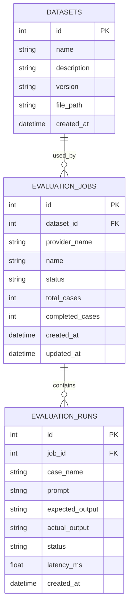
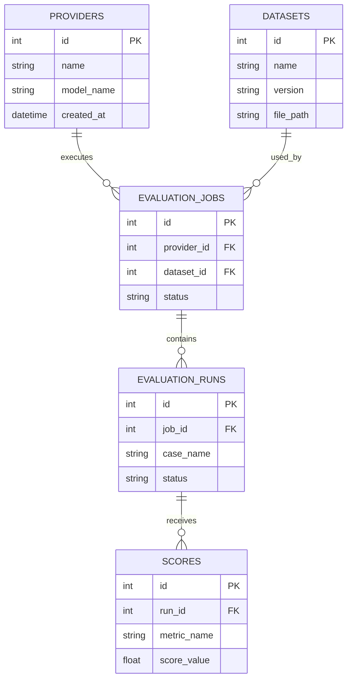

# EvalHub Architecture

## 项目定位

EvalHub 是一个多模型大语言模型自动化评测平台。`40day-lab` 保存
Day 1–10 的学习过程；正式产品代码从 Day 10 起发布到独立的
`xl819436-creator/EvalHub` 仓库。

## Day 10 当前实现

Day 10 只实现以下三张表：

1. `datasets`
2. `evaluation_jobs`
3. `evaluation_runs`

当前实现使用 `evaluation_jobs.provider_name` 保存 Provider 名称。
`providers` 表尚未建立，因此当前数据库不存在 `provider_id` 外键。

## 表关系

- 一个 dataset 可以被多个 evaluation job 使用。
- 一个 evaluation job 包含多条 evaluation run。
- 删除 job 时，其 runs 由外键 `ON DELETE CASCADE` 自动删除。
- dataset 已经被 job 引用时，SQLite 会拒绝删除该 dataset。

## CRUD 能力

| 表 | Create | Read | Update | Delete |
|---|---|---|---|---|
| `datasets` | 是 | 是 | 是 | 是 |
| `evaluation_jobs` | 是 | 是 | 是 | 是 |
| `evaluation_runs` | 是 | 是 | 是 | 是 |

测试使用独立的临时 SQLite 文件，不污染正式数据库。

## 未来目标结构

后续阶段计划增加：

- `providers`：模型服务提供商；届时 job 改为引用 `provider_id`
- `scores`：单条 run 的一个或多个评分结果

目标 ER 草图如下。它用于说明后续表关系和主外键，不代表 Day 10 已经创建
`providers` 与 `scores` 表：

该目标结构是路线规划，不代表 Day 10 已经实现。

## Day 09 与 Day 10 的关系

- Pydantic 负责在数据进入业务层之前校验字段。
- SQLite 负责持久化已经通过校验的数据。
- 数据库额外负责主键、外键、事务和完整性约束。

## MVP 边界

第一阶段计划包含 JSONL、Provider、评分器、SQLite、FastAPI 和报告。
暂不包含前端页面、模型训练、分布式任务系统和复杂权限系统。
